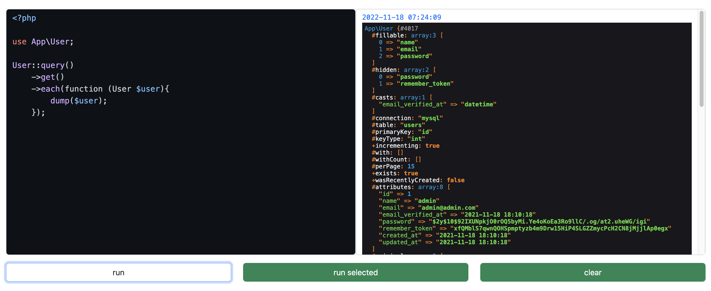

# laravel-code-runner



[ENGLISH](README.md) | [简体中文](README-zh_CN.md)

> Run the PHP code in the browser. - 在浏览器中运行 PHP 代码。

[](https://github.com/guanguans/laravel-code-runner/actions)
[](https://github.com/guanguans/laravel-code-runner/actions)
[](https://codecov.io/gh/guanguans/laravel-code-runner)
[](//packagist.org/packages/guanguans/laravel-code-runner)

[](//packagist.org/packages/guanguans/laravel-code-runner)
[](//packagist.org/packages/guanguans/laravel-code-runner)

## Requirement

* PHP >= 7.4
* Laravel >= 7.0

## Installation

You can install the package via composer.

```bash
composer require guanguans/laravel-code-runner --prefer-dist -vvv
```

You must publish the assets from this package by running this command.

```bash
php artisan code-runner:install
```

You can publish the config file of the package(optional).

```bash
php artisan vendor:publish --provider="Guanguans\LaravelCodeRunner\CodeRunnerServiceProvider" --tag="code-runner-config"
```

## Usage

By default this package will only run in a local environment.

Visit `/code-runner` in your app to view page.

### Authorization

Should you want to run this in another environment (we do not recommend this), there are two steps you must perform.

1. You must set the `enabled` variable in the `code-runner` config file to `true`.

2. You must register a `view-code-runner` ability. A good place to do this is in the `AuthServiceProvider` that ships with Laravel.

```php
use Illuminate\Contracts\Auth\Authenticatable;

public function boot()
{
    $this->registerPolicies();

    Gate::define('view-code-runner', function (?Authenticatable $user = null) {
        // Return true if access to web tinker is allowed. Here's an example:
        return $user && in_array($user->email, [
            'admin@example.com',
        ]);
    });
}
```

## Testing

```bash
composer test
```

## Changelog

Please see [CHANGELOG](CHANGELOG.md) for more information on what has changed recently.

## Contributing

Please see [CONTRIBUTING](.github/CONTRIBUTING.md) for details.

## Security Vulnerabilities

Please review [our security policy](../../security/policy) on how to report security vulnerabilities.

## Credits

* [guanguans](https://github.com/guanguans)
* [All Contributors](../../contributors)

## License

The MIT License (MIT). Please see [License File](LICENSE) for more information.
